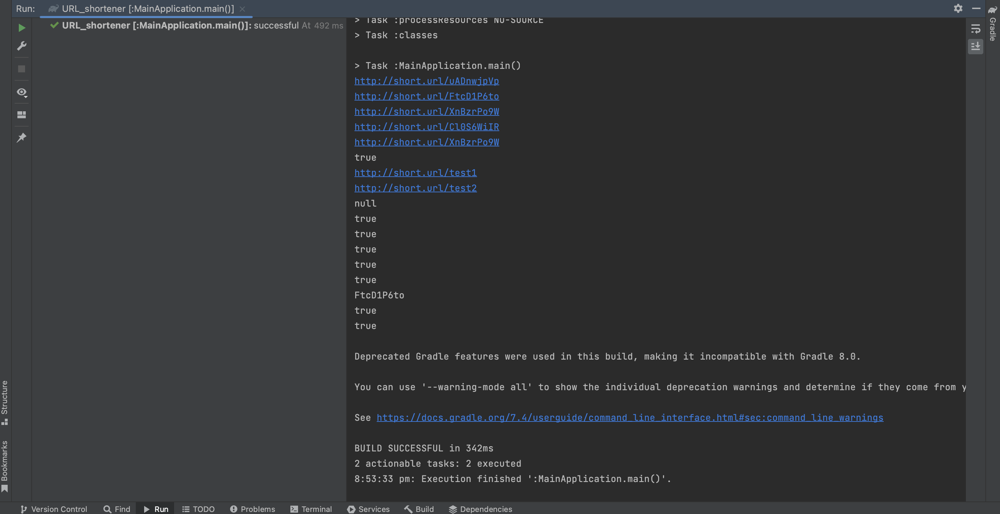

# URL_Shortener

## Table of contents
* [Objective](#objective)
* [Background](#background)
* [Primary goals](#primary-goals)
* Project Implementation :
* [Phase 1](#phase-1)
* [Phase 2](#phase-2)
* [Phase 3](#phase-3)
* [Output](#output)

## Objective
* Create a utility that will register a short URL for a given longer URL and store it. 
* Provide methods that users can invoke to retrieve the longer URL based on the short URL.

## Background
URL shortening is a technique on the internet in which a Uniform Resource Locator (URL) can be made substantially shorter and still direct you to the required page. This shorter URL makes it easier to distribute the link.
This is achieved by using a URL Shortening service/utility which takes the longer URL as input and generates a shorter URL for it. When the Short URL is used to open the webpage, the utility gets this request and redirects you to the web page of the corresponding longer URL.

For example, the URL "https://en.wikipedia.org/wiki/URL_shortening" can be shortened to "https://w.wiki/U" and the URL "https://example.com/assets/category_B/subcategory_C/Foo/" can be shortened to "https://example.com/Foo"

Reference: You can read more details about URL shortening on this [wiki page](https://en.wikipedia.org/wiki/URL_shortening)

## Primary goals
* Build the Short URL utility from scratch in Java
* Compile and test the functionality

## Implementation

## Phase 1 
### Create Gradle Project and write interface method for Short Url generation and retrieval

#### Key Files
* ShortURL.java 
Defines the interface with methods needed for the Short URL utility. Comments in this file define what each method should do.
* ShortURLImpl.java 
It should implement the ShortURL interface.
* MainApplication.java
Starting point for execution. This file initializes the ShortURLImpl object and tests out the functionality. 

## Phase 2 
### Implement Custom Url and Hit Count features
Implement the functionality that will enable users to specify their own custom short URL. Also, implement functionality to retrieve the count of how many times a long URL has been looked up.

#### Requirements
1. Complete the registerNewUrl(String longUrl, String shortUrl) method in ShortURLImpl.java. This is an overloaded method which takes an extra parameter.
2. Users can specify their own custom shortUrl to be used for a longUrl, using this method. This along with the earlier registerNewUrl(String longUrl) method allows users the flexibility to specify the optional custom short Url.
3. If the shortUrl already exists, return null.
4. If the shortUrl is not present, register a mapping between the longUrl and shortUrl specified and return the shortUrl.

Note1: Assume that the short URL specified by user will conform to this pattern - http://short.url/<alphanumericstring>
Note2: Assume that the user will not specify a longUrl which is already present or used.

5. Complete the getHitCount(String longUrl) method in ShortURLImpl.java.
This method should return the number of successful lookups (using getUrl()) that are resolved to the specified longUrl.

Note: The lookup will happen based on shortUrl, but the count needs to be kept for the corresponding longUrl which is looked up.

6. Refactor any of the other methods required to support this functionality.
Do not reset the Hit Count for a longUrl even if the longUrl is deleted using delete().

## Phase 3 
### Check if the output is as per desired output 
Here, I didn't write test case since it is smaller project to demonstrate JAVA basics understanding.
Added comments in ShortURLImpl.java for understanding

That's it! :)

## Output

